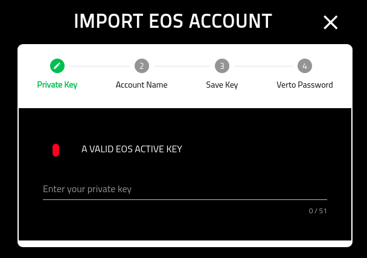
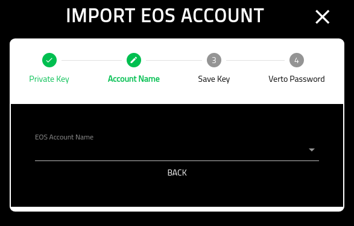
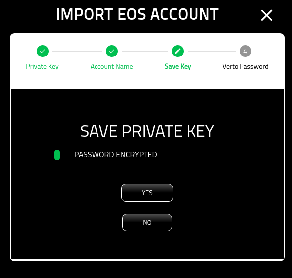
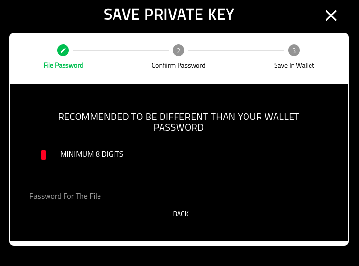
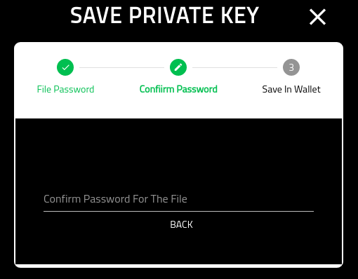
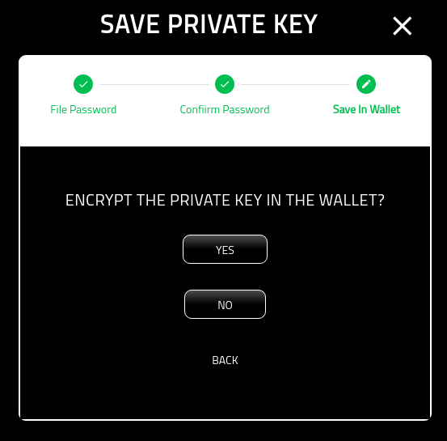
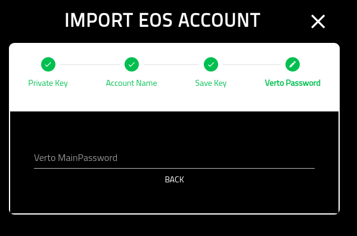
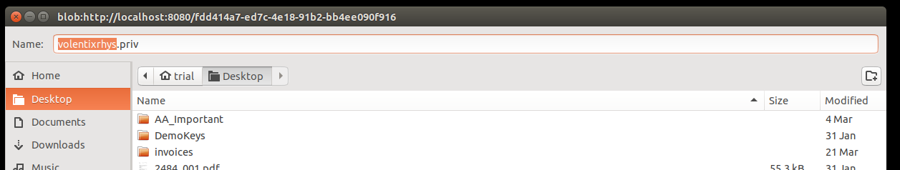

Add EOS
=============

=================
About
=================

This page details the actions required to add an EOS wallet to Verto.

Note that this process is a little more intense than the other functions of adding a wallet.

=================
EOS Private Key
=================

This screen requires you to put in the private key associated to your account.

The key must be a valid EOS active Private key.

Note that future iterations of Verto will support more ways of importing an EOS account.

=================
EOS Account Name
=================

Note that EOS allows multiple accounts to be associated to the key.

This screen allows you to select one of the accounts associated with this key.

Finally, you can import the other EOS account names into separate wallets in Verto.

=================
Save Private Key
=================

This is entirely optional, however, you should at least download an encrypted version of your private key for save keeping.

If you select 'NO', you will proceed to the 'Verto Password' screen.

=================
File Password
=================

On this screen you are asked to provide the password that will be used to encrypt the private key.

Note that it is recommended that you select a different password from the wallet.

Also note that this password is non-recoverable. If you loose the password Volentix, nor any of its partners, are able to get it back for you.

=====================
Confirm File Password
=====================

This screen requires that you confirm you password from the previous screen.

=================
Save In Verto
=================

Some users may want to store their private key (encrypted) inside of Verto, however, it is not required.

Note that, from the Wallet Manager you are able to add/remove private keys to any account.

Selecting 'YES' stores an encrypted copy of your private key inside the wallet. Note that, although Verto config is itself encrypted, the private key remains encrypted even after the configuration has been decrypted. It still requires the password from the previous steps to decrypt it.

=================
Verto Password
=================

On the final screen you must put in your Verto password.

If you opted to download an encrypted copy of the password, your file system browser will appear in order for you to select where to save the file.

Note that we recommend storing the file on a removable storage device such as a USB.

Once completed, you will be redirected to the new EOS wallet in Verto.