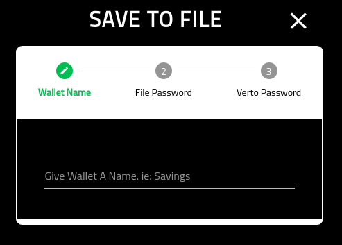
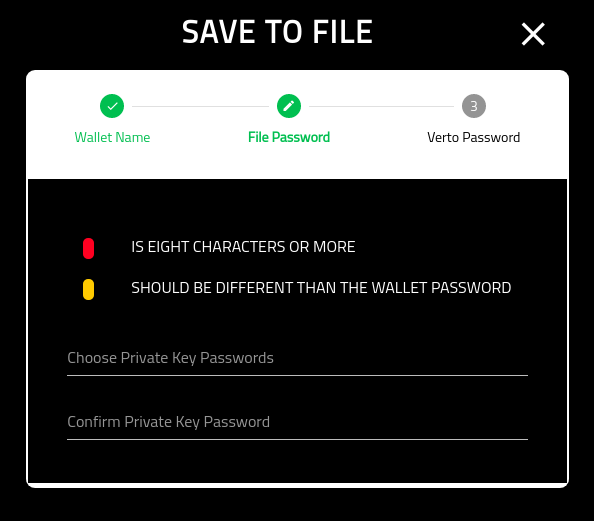
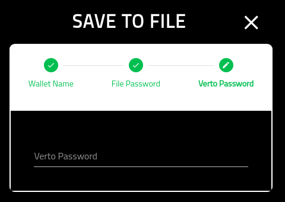

Create Ledger Save File
=======================

=================
About
=================

This page provides the details for creating a new Ledger wallet and downloading the private key in an encrypted file.

=================
Wallet Name
=================

Provide the wallet with a meaningful name.

Note that this cannot be changed later.

=================
File Password
=================

On this screen you are asked to provide the password, and confirm it, that will be used to encrypt the private key.

Note that it is recommended that you select a different password from the wallet.

Also note that this password is non-recoverable. If you loose the password Volentix, nor any of its partners, are able to get it back for you.

=================
Verto Password
=================

On the final screen you must put in your Verto password.

Once you have completed this screen you will be redirected into the new wallets home screen.

