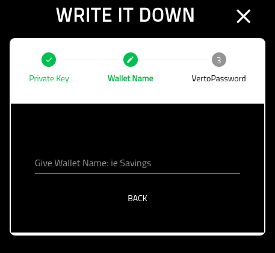

Create Ledger Write It Down
===========================

=================
About
=================

This page provides the details for creating a new Ledger wallet and writing down the private key.

=================
Show Private Key
=================

This screen shows you the private key generated. Note that once you have completed the creation of the wallet, this is no longer available in the wallet.

Note that the key shown below is useless and never used.

Once you have completed writing down the private key, click the 'I AM DONE WRITING MY KEY DOWN' button.

=================
Wallet Name
=================

You must now provide the wallet with a name. Choose something meaningful.

Note that this cannot be changed later.

=================
Verto Password
=================

On the final screen you must put in your Verto password.

Once you have completed this screen you will be redirected into the new wallets home screen.

