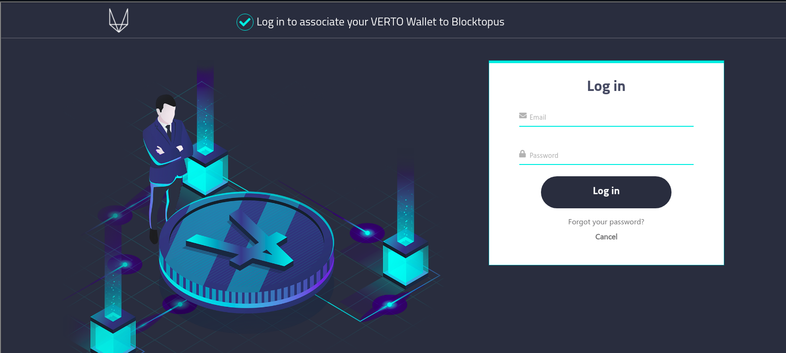
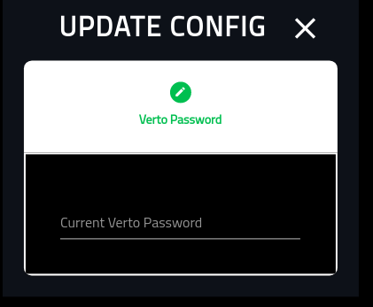

Associations
============

===========
About
===========

This page provides a high-level overview of associating a Verto account to trusted third parties.

For example, in order to Get VTX, you must first associate your Verto public key with Blocktopus or Zixipay.

============
Starting Out
============

When you open this screen for the first time, you will have nothing associated to it. As a result, it will appear as the following.

=================
It Starts With No
=================

If you do not want any third parties associated with this wallet, simply click the 'Not Now' option. 

If you do, you will be asked for your Verto password in order to update Verto config with your decision.

By selecting 'Not Now' for all the associations, you will end up with the screen appearing as follows:

========================
Icons
========================

The icons, that end up appearing on the panel as as follows:

1. Thumbs Down: This shows that the wallet is not yes associated with the service.

2. Thumbs Up: This shows that a wallet is associated with a service. Note that you cannot delete an association.

3. Edit: If you have a thumbs down, you will also have the pencil (edit) icon. Clicking on this icon will open up an association for editing.

4. Close Edit: If you have opened up an association for editing, you will see  a red X on the right. You can close the association by clicking it.

========================
Venue
========================

Note that to associate the wallet with Venue, you must already have an account registered and confirmed. 

If you do not have an account already, please create one `here <https://venue.volentix.io/>`_

With an account set up, and confirmed, select the edit button.

Once selected, you will see the following screen. To associte the wallet with Venue, simply click 'Yes'

Note that Verto does NOT store your Venue credentials in the wallet. They are used in a one time event.

Add your Venue username.

Put in your Venue password.

The final screen requires your Verto password in order to update your wallet.

Once you click save, you will be redirected to the Associations screen again. Note that Venue has now been associated to the wallet.

========================
Blocktopus
========================

Select the edit button.

You are provided with two options when associating your wallet with Blocktopus.

The 'CREATE ACCOUNT' option is in the event that you do not yet have a Blocktopus account,
The 'LOGIN' option is in the event that you do have an account but have not yet associated your wallet.

If you choose to 'CREATE ACCOUNT' you will be provided with the following screen.

If you choose to 'LOGIN' you will be provided with the following screen.

Once you have successfully associated the wallet with Blocktopus, you will need to provide your Verto password in order to preseve the association.

Upon successful completion your Blocktopus association will show thumbs up.

========
ZIXIPAY
========

Select the edit button.

Select the 'YES' button to associate the wallet with Zixipay.

Provide your Verto password to update the config.

Upon successful completion your Zixipay association will show thumbs up.

=====================
Everything Associated
=====================

Once everything (optional) has been associated, your screen will look like the following.

