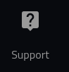

Get VTX
============

===========
About
===========

This page provides a high-level overview for qualified investors who are seeking to get vtx.

In order to Get VTX, you must:

1. Associate your Verto public key with Blocktopus.
2. Successfully KYC with Blocktopus.
3. Get Whitelisted

============
Starting Out
============

You can navigate to the Crowdfund summary page from your wallet. Click the 'View Crowdfund' button.

Once you have selected to View Crowdfund, you will be directed to the Crowdfund summary screen.

You are presented with two options:

1. Get VTX: Use a native chain to get your own VTX.
2. Get VTX History: To see the history of your transactions.

To know more about the transaction history page, please see the following:

.. toctree::
   :maxdepth: 1

   viewhistory.rst

===========
Status
===========

In order to get vtx, you must be a qualified investor that has KYC'd as well as been selected for whitelist. By selecting the 'Get VTX' button, you will be guided through the process.

--------------
Paused
--------------

In the event that crowdfund has been paused, you will recieve the following screen.

----------------------
Wallet Not Associated
----------------------

You must first associate your wallet as well as create an account on Blocktopus. If you see the following message, simply click on the 'Associate Blocktopus Now' button and you will be redirected to the Associations screen. From there you are able to create or associate an account with your Verto public address.

------------------
Waiting For KYC
------------------

If you see the following screenshot, it means that the wallet is associated with Blocktopus, but has not yet been approved.

If you are experiencing a delay, please reach out to the Blocktopus team for assistance.

-------------------
Waiting Approval
-------------------

Once KYC'd, you may still need to be approved by the team. If you see the following message it means you have not yet been approved

If you are experiencing a delay, please reach out to the Verto team for assistance. Simply click the 'Support' button on the left hand menue.

-------------
Approved
-------------

If you have completed the process, you will be re-directed to the 'Request Address' screen and are now ready to get vtx.

For more information on requesting an address, please see the following:

.. toctree::
   :maxdepth: 1

   requestAddress.rst

