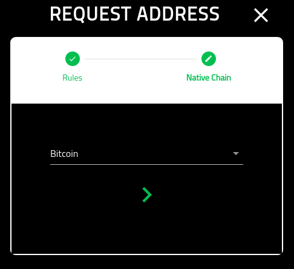
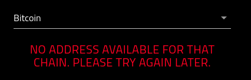

Request Address
================

===========
About
===========

This page provides an overview if requesting an address for Crowdfund. This address, once allocated will be used to send tokens to.

Note that:

1. Addresses are only good for 15 mins
2. You can only get one address an hour

---------------------------------------------
Summary Screen
---------------------------------------------

You must first agree to the terms before having an address allocated for you.

.. image:: img/requestAddress.png
   :alt: Create Verto Wallet
   :align: center

-------------------
Get Address
-------------------

Once you agree to the terms, you will now be able to claim an address.

In the event that no address is available, you will be presented with the following error message.

If you are successful, you will be directed to the screen with you allocated address.

For more information on using the allocated address, please see the following:

.. toctree::
   :maxdepth: 1

   claimvtx.rst

