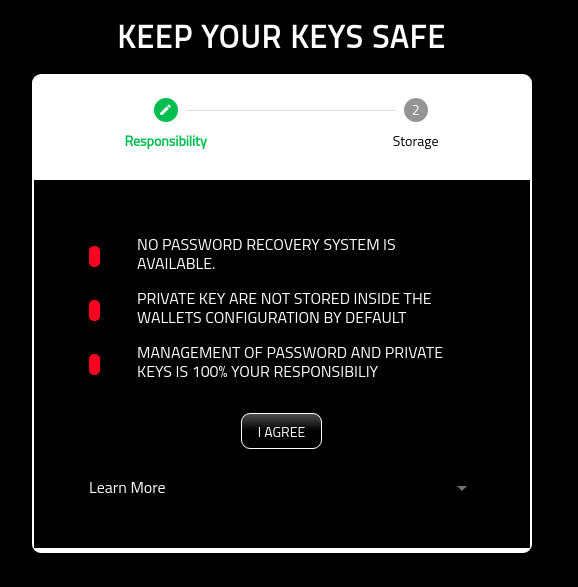
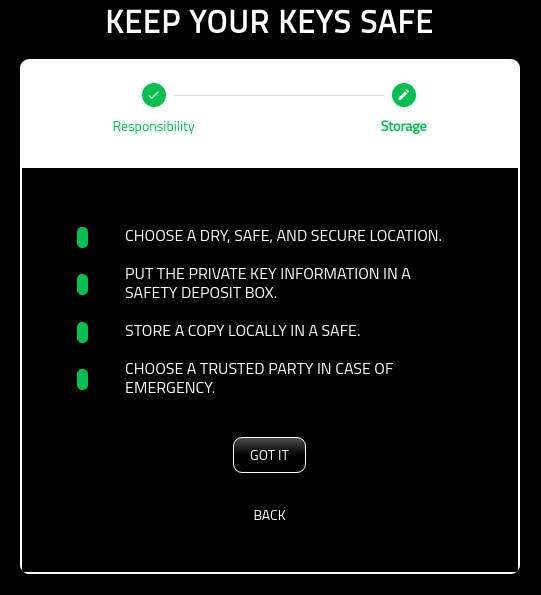
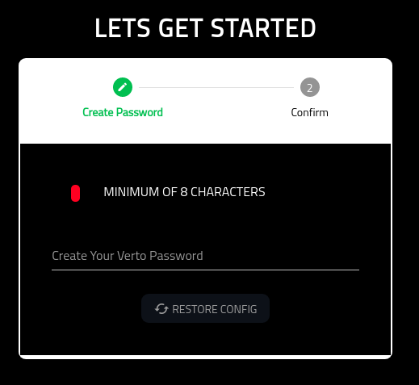
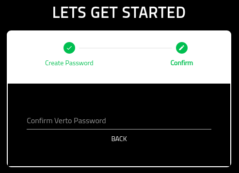
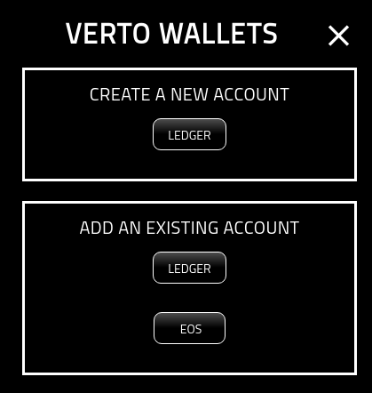

Setup Wallet
============

=================
About
=================

This page describes the workflow when a user opens the wallet for the first time.

=================
Note
=================

Please note that you are entirely responsible for the management, safety, protection, and recovery of your private key. No one else including partners of the Volentix ecosystem.

You have 2 choices on persisting your private key. Both methods are designed to ensure your private key remains safe.
Write your key down.

Or, encrypt your key in a password protected file.
Plan a strategy for the physical storage of your private key. This storage strategy should include long term thinking, including:
Physical Security: Vaults of any kind that provide the protection you are seeking. Think of somewhere you know is safe from theft as well as the elements. some examples are a home or bank safe, or lawyer. you may choose to protect your keys by storing copies in multiple places.
Legacy: Things happen. Life ends. You need to plan for the transference of your wallet to someone else. In some cases that may be a will, please consider your options carefully. The choice is yours.

=================
Responsibilities
=================

The following screen ensures that you are aware of your responsibities for the safe keeping and management of your wallet, its private keys, and its configuration.

In short, Verto does not have a central service for the management of Verto configurations. The configuration will always remain on your laptop.

As a result, Volentix, or any of its partners, are not able to restore, or recover any of its configuration.

Additionally, passwords are not stored. As a result, users are 100% responsible for the management of their passwords. No backup is provided by Volentix or any of its partners.

To be as clear as possible.... we strongly believe that whatever happens in Verto remains in the control of the user with no outside influences.

Finally, Verto collects no metrics of  usage from the user. We want none of your data. Anonymity is a sovereign right of the Volentix ecosystem.

The following is the first screen you will see when opening the wallet.

By selecting 'I AGREE', you are agreeing to the terms of use.

=================
Key Mangement
=================

You are responsible for the management, and storage of your keys.

In short, we suggest backing up the private key onto a physical storage device (USB, or paper) that will last the test of time.

Once backed up, you should store a copy of the key in a dry, safe, and secure location such as a saftey deposit box.

The following page identifies some best practices for managing your key.

=====================
Create Verto Password
=====================

On this screen, you are asked to create a password for Verto. The only restriction is that it must be at least eight digits in length.

Please note: Your password is NEVER stored in Verto. Only you have the copy of your password.

For some recommendations on creating password, plesae review the following links:

External hyperlinks:

* `PluralSight: Best Practice <https://www.pluralsight.com/blog/security-professional/modern-password-guidelines/>`_
* `UCSB <https://security.ucsb.edu/news/password-best-practices>`_

======================
Confirm Verto Password
======================

Once you have added your password, you will need to then confirm the password. Once the two passwords match, you will be able to proceed.

======================
Success
======================

Once you are successful, you will be presented with the following page.

Next steps. Add a Wallet!

.. toctree::
   :maxdepth: 1

   addWallet.rst