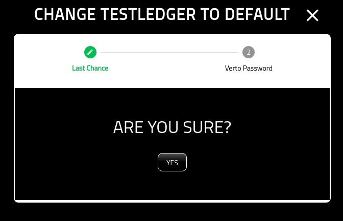
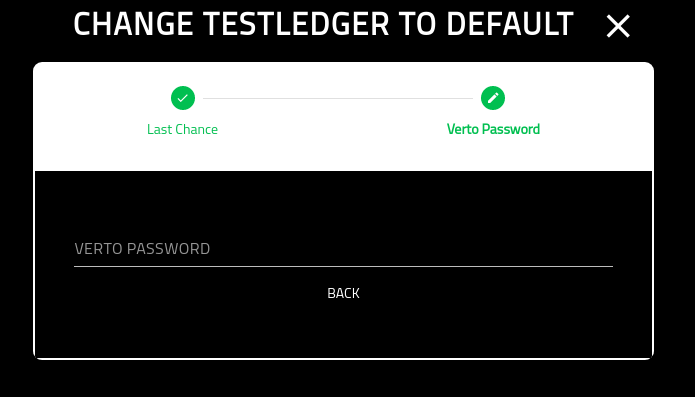

Change Default Wallet
=====================

===============
About
===============

This screen allows you to change your default wallet. At this point, you have already selected the wallet to become default from the Wallet Manager.

=============
Confirmation
=============

A simple confirmation screen before you change the default. Click 'Yes' to continue.

=================
Verto Password
=================

On the final screen you must put in your Verto password.

Once you have completed this screen you will be redirected back to the wallet manager.

