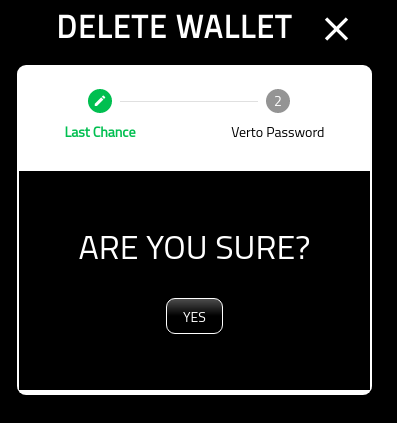
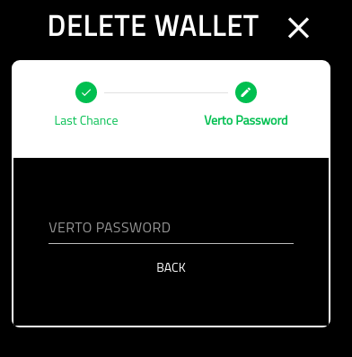

Delete Wallet
=============

===========
About
===========

This page provides the details on deleting a wallet from Verto.

Please note, it is not possible to retrieve the deleted wallet once removed. 

Please ensure you have backed up Verto as well as the private key associated with the wallet.

=============
Confirmation
=============

A simple confirmation screen before you delete the wallet from Verto.

=================
Verto Password
=================

On the final screen you must put in your Verto password.

Once you have completed this screen you will be redirected back to the wallet manager.

