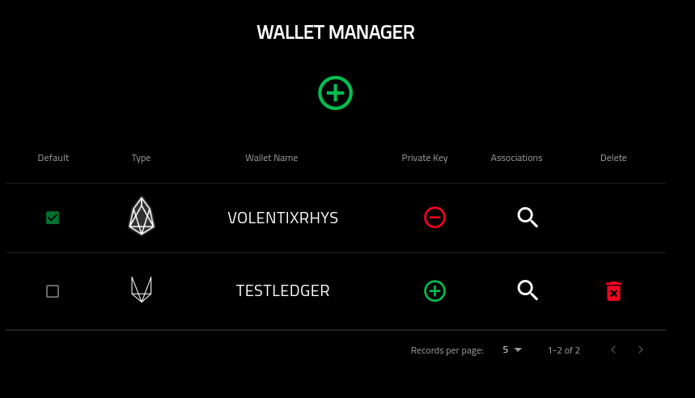
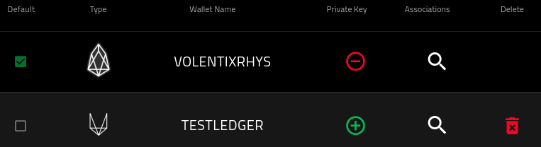
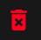
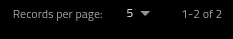
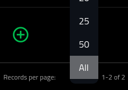

Wallet Manager
==============

===========
About
===========

This page provides a high-level overview of the wallet manager and its functions.

=============
Adding Wallet
=============

In the center of the screen, there is a plus sign in green. Pretty hard to miss. It looks like the following.

Clicking on this will redirect you to the Add Wallet Screen

To learn more about Add Wallet functionality, please see the following.

.. toctree::
   :maxdepth: 1

   ../addWallet.rst

========================
Understanding The Table
========================

The following is an image of the wallet table containing two rows in order to showcase the functions available.

The columns shown above, can be defined as:

1. Default: One wallet is always default. You can change which wallet is default by clicking on the checkbox of a non-default wallet. 

To learn more about changing the default wallet, please see:

.. toctree::
   :maxdepth: 1

   changeDefaultWallet.rst

2. Type: This is the type of wallet. Currently only two wallet types are supported. Ledger and EOS.

The EOS wallet has the following image:

The Ledger wallet has the following image:

3. Wallet Name: This column has the name of the wallet. Note that this name cannot be changed. If you click on the name, you will be redirected to the wallets screen.

For more information on the wallet screen, please see:

.. toctree::
   :maxdepth: 1

   wallet.rst

4. Private Key: This column shows if the wallet has, or does not have, a private key stored within the Verto configuration. Its images are as follows:

For wallets with a private key stored within them, the following is shown:

By clicking on the image, you are able to delete the private key within the Verto config. For more information please see:

.. toctree::
   :maxdepth: 1

   deletePrivateKey.rst

For wallets without a private key stored within them, the following is shown:

By clicking on the image, you are able to add the private key within the Verto config. For more information please see:

.. toctree::
   :maxdepth: 1

   addPrivateKey.rst

5. Associations: You can associate your wallet to various external parties in order to leverage more advanced features in Verto.

Click the icon below to manage your associations.

For more information about managing associations for a wallet, please see the following:

.. toctree::
   :maxdepth: 1

   ../associations/index.rst

6. Delete: The final column is in the event that the user wants to delete a key. Note that the default key cannot be deleted.

By selecting the icon, you are redirected to delete the wallet from Verto. For more information please see:

.. toctree::
   :maxdepth: 1

   deleteWallet.rst

7. Number Of Results Shown: At the bottom right of the wallet, you are able to select the number of visible rows within the wallet. Default is 5.
walletManagerNumRecords

Clicking on it will open up the options for how many records to display.

