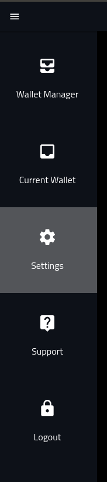

# Development Task Request - Display Error When Migrating To Quasar v1


## Repository

https://github.com/Volentix/verto

## What is Verto
[Verto](https://volentix.io/verto/) it is the Crypto Asset Manager of a decentraized ecosystem for normal everyday users.

Verto is:

1. User friendly
2. Peer to peer
3. Multi-blockchain
4. Multi-platform
5. Data management controlled by the user

Verto also integrates functionality of other DApps:

1. Orderbook settlement through [VDEX](https://volentix.io/documentation/vdex-whitepaper/)
2. KYC with [Blocktopus](https://blocktopus.io/)
3. Multi-payment gateways like [Zixipay](https://zixipay.com/login)
4. A crypto ratings and rankings dashboard from [Vespucci](https://vespucci.site/)
5. Anonymous coin trading with with [Coinswitch](https://coinswitch.co/)

## Task Request

### Tech

1. [Quasar](https://quasar-framework.org/)
2. [Electron](https://electronjs.org/)

### Goal

As a user, I want to see my `choose curreny` options appear properly so that I can read the sceeens instructions.

### Details

When we migrated to Quasar v1, we have experienced a series of L&F issues. The first of these issues is that the choose currency option is not displaying correctly.

In the previous version, the screen appeared as follows:


After the migration changes, the image apprears as the follows.


### Setup

If you prefer the video [](https://www.youtube.com/watch?v=ong80lAty5A)

```
Public Key: EOS8X7vq8mv6LLfQgqFUzfNqL5ANiutgdY59154c3579KtvWjcWfW

Note that this key's private key has been burned and no transactions will be available on the main net.
```

In order to reproduce the issue you must be on the developer branch and using Quasar v1.

Launch the application:

You will need to switch to the testnet.

1. Select the `Settings` option on the right hand nav menue.



2. Inside `Settings` choose the testnet toggle.


3. From the right hand nav (above) select the `Wallet Manager` option.

4. Add a wallet by selecting the Green '+' button to the left of the `Wallet Manager` title.

5. In `Import An Existing Account`, click the `Ledger` button.

6. Add a wallet with the address above: 

7. The new wallet should open up. If not, navigate to `Wallet Manager` and select the wallet.

8. Click the `View Crowdfund` button.

9. Select the `Contribute` button.

10. You will now see the page.


### What Success Looks Like

The application runs as before and page navigation remains intact and working.

## Bounty

### Prerequisite

In order to receive the VTX bounty, as we are not yet listed, you must:

1. Not be an American citizen
2. KYC with [Blocktopus](https://blocktopus.io/)

### Amount

A bonus amount of VTX tokens matching the BTC value of the Utopian reward will be given. Effectively doubling the rewards for the contributor when working on Volentix related tasks.

### Deadline

<DEADLINE_DETAILS>

## Communication
Contributor can get in touch with us on Discord: https://discord.gg/xDwczRk

## GitHub Account
https://github.com/<GIT_HUB_USER_NAME>